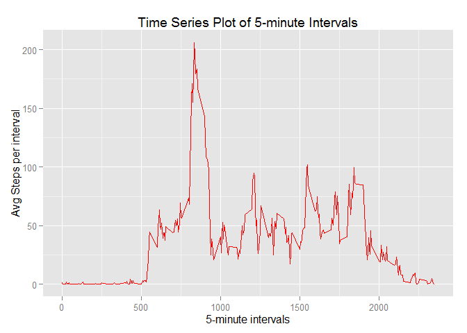

# Reproducible Research: Peer Assessment 1
### Load required libraries/set options  

```r
echo = TRUE # Echoes code for visibility
library(ggplot2)
library(Hmisc)
```

```
## Loading required package: grid
## Loading required package: lattice
## Loading required package: survival
## Loading required package: splines
## Loading required package: Formula
## 
## Attaching package: 'Hmisc'
## 
## The following objects are masked from 'package:base':
## 
##     format.pval, round.POSIXt, trunc.POSIXt, units
```

## Loading and preprocessing the data  
## Loading and preprocessing the data
##### 1. Load the data (i.e. read.csv())

```r
if(!file.exists('activity.csv')){
    unzip('activity.zip')
}
raw_actData <- read.csv('activity.csv')
raw_actData$date<-as.Date(raw_actData$date,format="%Y-%m-%d")
actData<-raw_actData[complete.cases(raw_actData),]
```


## What is mean total number of steps taken per day? 
The missing values in the data-set are ignored for this part    


```r
DailySteps<-aggregate(actData$steps, list(actData$date), sum)
```

##### 1. A histogram of the total number of steps taken each day

```r
m<-ggplot(data=actData,aes(actData$date,actData$steps))
m+geom_histogram(stat="identity",alpha=0.75)+labs(title = "Steps Taken Each Day", x = "Date", y = "Total steps per Day")
```

 
##### 2. Calculate and report the mean and median total number of steps taken per day

```r
meanDailySteps<-mean(tapply(actData$steps,actData$date,sum))
medianDailySteps<-median(tapply(actData$steps,actData$date,sum))

meanDailySteps
```

```
## [1] 10766.19
```

```r
medianDailySteps
```

```
## [1] 10765
```
The mean number of Daily Steps is: 1.0766189\times 10^{4}  
The median number of Daily Steps is: 10765

## What is the average daily activity pattern?  

```r
meanStepsPerInterval <- aggregate(actData$steps, by=list(actData$interval), FUN=mean)
names(meanStepsPerInterval)<-c("Interval","MeanSteps")
```
#####  1.Make a time series plot of the 5-minute interval (x-axis) and the average number of steps taken, averaged across all days (y-axis)     

```r
m<-ggplot(data=meanStepsPerInterval,aes(meanStepsPerInterval$Interval,meanStepsPerInterval$MeanSteps))
m+geom_line(color="red")+labs(title = "Time Series Plot of 5-minute Intervals", x = "5-minute intervals", y = "Avg Steps")
```

 

##### 2. Which 5-minute interval, on average across all the days in the dataset, contains the maximum number of steps?

```r
maxInterval<-meanStepsPerInterval[meanStepsPerInterval$MeanSteps == max(meanStepsPerInterval$MeanSteps),1]
maxSteps<-meanStepsPerInterval[meanStepsPerInterval$MeanSteps == max(meanStepsPerInterval$MeanSteps),2]
```

The interval with most average activity is: 835 with an average of 206.1698113  
  
## Imputing missing values  

##### 1. Calculate and report the total number of missing values in the dataset  

```r
NA_count<-length(which(is.na(raw_actData$steps)))
```
The total number of rows with missing values is: 2304

##### 2.Devise a strategy for filling in all of the missing values in the dataset.  
##### 3.Create a new dataset that is equal to the original dataset but with the missing data filled in.   
The impute() function from the Hmisc package was used to fill in the missing values.         
This was invoked with fun='mean' which averaged steps across the entire data set.    

```r
imputedActData<-raw_actData
imputedActData$steps <- impute(imputedActData$steps, fun=mean)
```
##### 4.Make a histogram of the total number of steps taken each day.

```r
z<-ggplot(data=imputedActData,aes(imputedActData$date,imputedActData$steps))+scale_y_continuous()
z+geom_histogram(stat="identity",alpha=0.75)+labs(title = "Steps Taken Each Day", x = "Date", y = "Total steps per Day")
```

 

##### Calculate and report the mean and median total number of steps taken per day.   

```r
NewMeanDailySteps<-mean(tapply(imputedActData$steps,imputedActData$date,sum))
NewMedianDailySteps<-median(tapply(imputedActData$steps,imputedActData$date,sum))

NewMeanDailySteps
```

```
## [1] 10766.19
```

```r
NewMedianDailySteps
```

```
## [1] 10766.19
```
##### Do these values differ from the estimates from the first part of the assignment?   
By excluding missing values, the mean is     : 1.0766189\times 10^{4}  
By excluding missing values, the median is   : 10765

By imputing the missing values, the mean is  : 1.0766189\times 10^{4}
By imputing the missing values, the median is: 1.0766189\times 10^{4}

##### What is the impact of imputing missing data on the estimates of the total daily number of steps?  
The mean remained the same (As the impute was performed using the mean)  
The median value of the 'imputed' data saw a change  

## Are there differences in activity patterns between weekdays and weekends?
##### 1. Create a new factor variable in the dataset with two levels - "weekday" and "weekend" indicating whether a given date is a weekday or weekend day.

```r
weekdays1<-c('Monday', 'Tuesday', 'Wednesday', 'Thursday', 'Friday')
imputedActData$DayType<-factor((weekdays(imputedActData$date) %in% weekdays1),levels=c(FALSE,TRUE),labels=c('weekend','weekday'))
```

##### 2. Make a panel plot containing a time series plot

```r
MeanStepsImputedData<-aggregate(imputedActData$steps,list(imputedActData$interval,imputedActData$DayType),mean)

names(MeanStepsImputedData) <-c("interval","DayType","steps")

final<-ggplot(MeanStepsImputedData, aes(interval, steps))

final + 
  geom_line(color="red") + 
  facet_grid(DayType ~ .) +
  xlab("5-minute intervals") + 
  ylab("Average number of steps")
```

 

